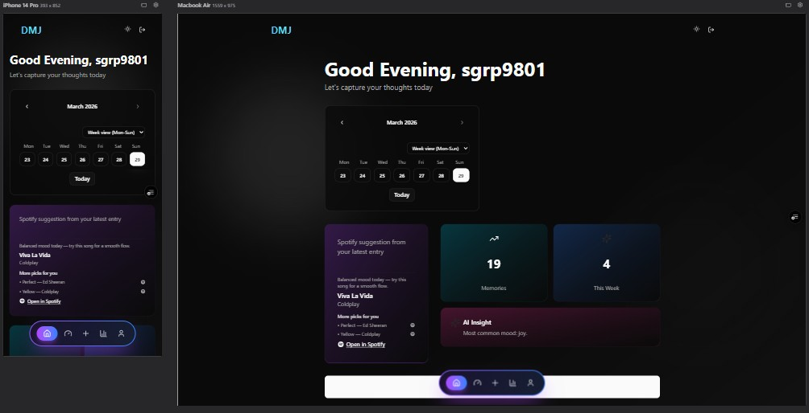
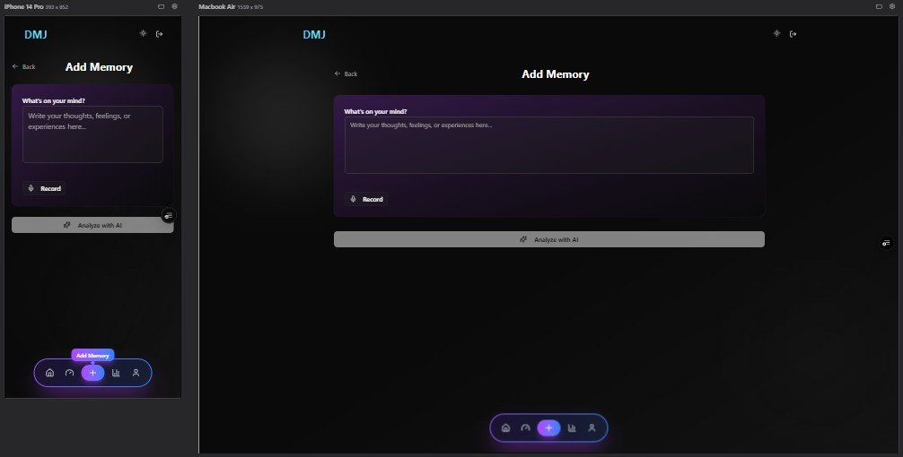
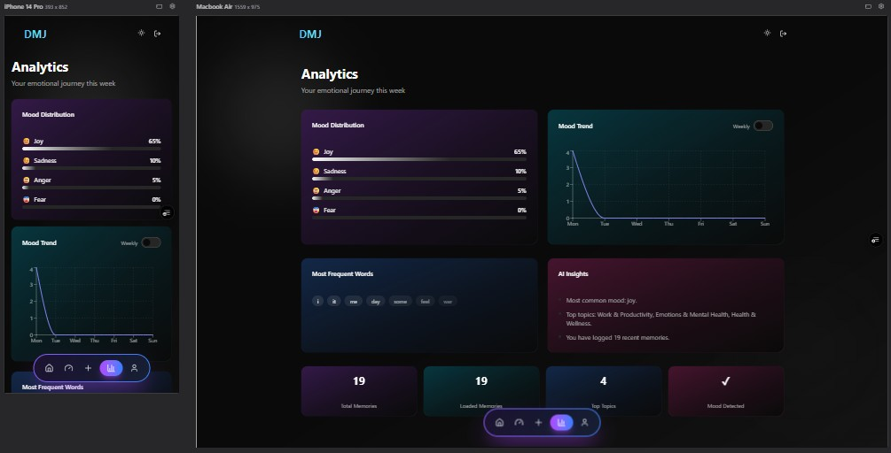
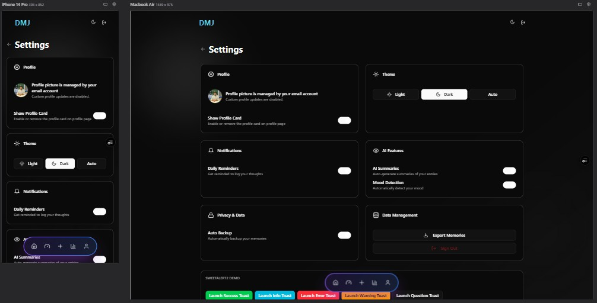
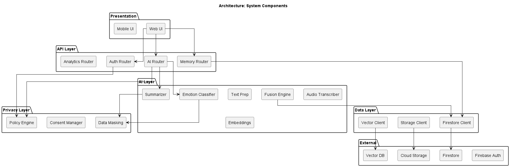
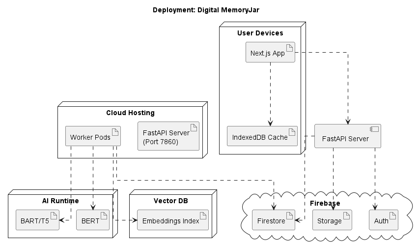
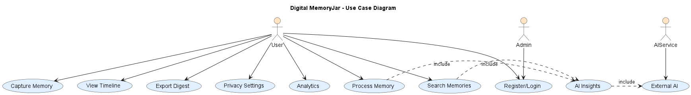
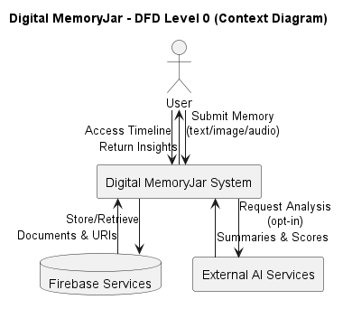
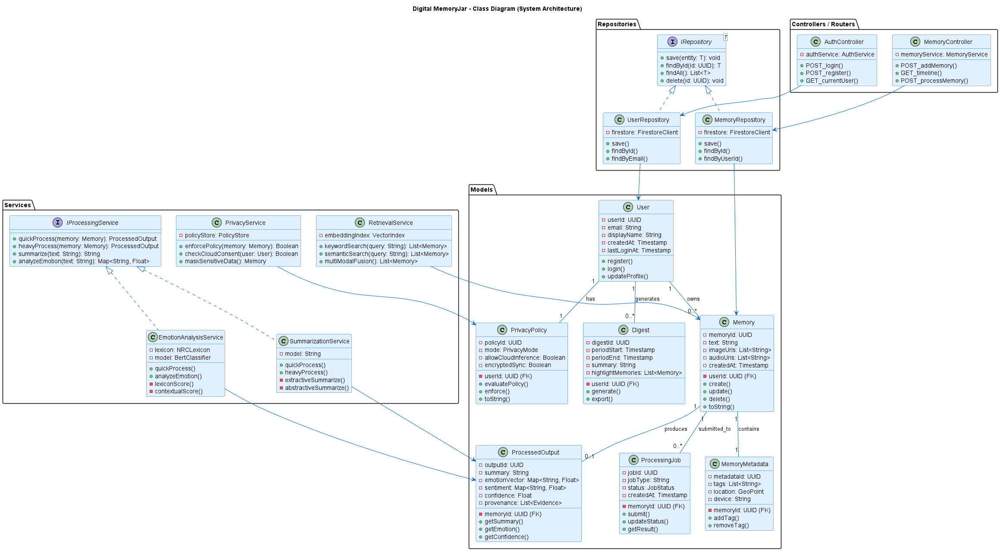
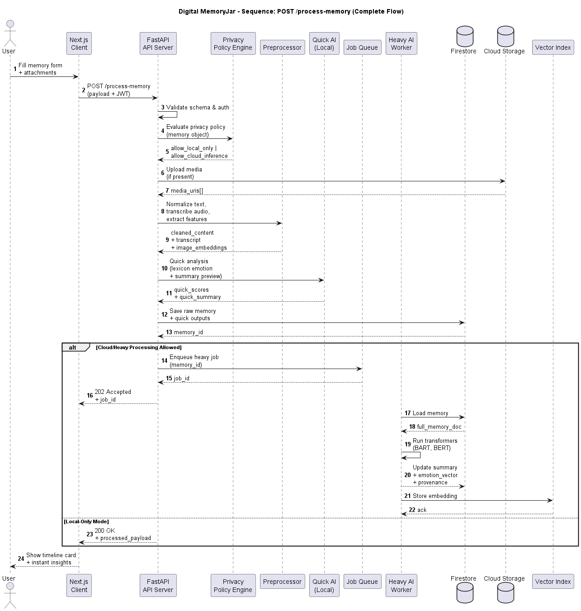

# Digital Memory Jar

Digital Memory Jar is an AI-powered journaling app that turns memories into insights with emotion analysis, mood-aware recommendations, and a clean glassmorphic interface.

## Documentation

GitHub shows only this root README on the repository page, so the backend docs are linked here for quick access.

- [Backend README](backend/README.md) - setup, API endpoints, and NLP pipeline details
- [UI Screenshots](#screenshots) - actual app views from the repo assets
- [Figures](#key-figures) - architecture, flow, and design diagrams

## At a Glance

- Frontend: Next.js 14, React, TypeScript, Tailwind CSS
- Backend: FastAPI, Python, APScheduler
- Data: MongoDB Atlas
- AI: Hugging Face, multilingual NLP, Spotify suggestions

## What It Does

- Lets users write memories with text or voice
- Analyzes mood, keywords, topics, entities, and summaries
- Shows trends in dashboard and timeline views
- Supports AI companion chat grounded in past entries
- Suggests music based on emotional context
- Works as a PWA with offline support

## Screenshots

<details>
<summary><b>Open UI Screenshots</b></summary>

| Main Dashboard | Add Memory |
| --- | --- |
|  |  |

| Analytics | Timeline |
| --- | --- |
|  |  |

| Settings |
| --- |
|  |

</details>

## Key Figures

<details>
<summary><b>Open Architecture Figures</b></summary>

| Architecture | Deployment |
| --- | --- |
|  |  |

| Use Case | Data Flow |
| --- | --- |
|  |  |

| Class Diagram | Sequence Diagram |
| --- | --- |
|  |  |

</details>

## Setup

### Frontend
```bash
npm install
npm run dev
```

### Backend
```bash
cd backend
python -m venv .venv
source .venv/bin/activate  # On Windows: .venv\Scripts\Activate.ps1
pip install -r requirements.txt
uvicorn main:app --reload --port 8000
```

For full backend details, see [backend/README.md](backend/README.md).

## Environment Variables

<details>
<summary><b>Frontend</b></summary>

- `NEXT_PUBLIC_API_URL` - Backend API URL

</details>

<details>
<summary><b>Backend</b></summary>

- `MONGO_URI` - MongoDB connection string
- `HF_API_TOKEN` - Hugging Face API token
- `SPOTIFY_CLIENT_ID` - Spotify app client ID
- `SPOTIFY_CLIENT_SECRET` - Spotify app client secret

</details>

## Deployment

- Frontend: Vercel
- Backend: Hugging Face Spaces
- Database: MongoDB Atlas
- Monitoring: Prometheus + Grafana via Docker Compose

## Monitoring

Run the local observability stack with:

```bash
docker compose up --build
```

- Backend metrics: `http://localhost:8000/metrics`
- Prometheus: `http://localhost:9090`
- Grafana: `http://localhost:3001` with `admin` / `admin`

The backend exports request latency, request counts, and NLP job metrics for Grafana dashboards.

## Notes

- The repo already includes the screenshots and figures under `DMj-Figures/`.
- If you add new images later, keep them in the same folder so the README stays consistent.